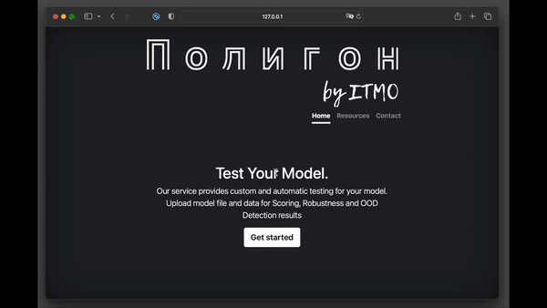
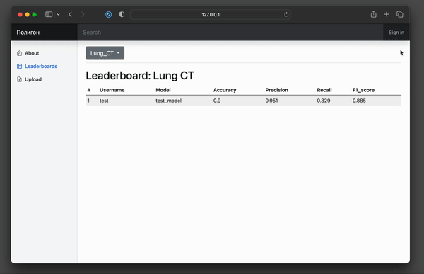

# Polygon

This repository contains tools for automated evaluation of model performance and robustness.

## Polygon-Scoring

### Project Description

Polygon-Scoring is a web application designed to evaluate the effectiveness of the developed model based on calculated metrics. The service provides information about the robustness of the model using standard methods for augmenting source data. Also, the user can select a specific dataset to obtain information about the model's ability for OOD (Out-of-Distribution) detection.

#### Usage

To use Polygon-Scoring applicaton just follow several steps:

1. Upload your model and data files
2. Define input data size
3. Select options for data augumentation
4. Select a distribution for OOD Detection evaluation
5. Submit the form and get your result

### Demo

## Polygon-Leaderboards

### Project Description

Polygon-Leaderboards is a web application for automated evaluation of the model performance and robustness on supervised datasets. Also, this service also provides the opportunity for users to compete in the accuracy and efficiency of their developed models by publishing the results of metrics for a specific task in leaderboards.

### Usage

To use Polygon-Leaderboards applicaton just follow several steps:

1. Create an account or sign in if you already have one
2. Go to the "Upload" page
3. Select the desired data modality
4. Fill the form with your model and data file, input data size
5. Submit the form
6. Publish your results and view them in leaderboard
7. Manage your published results in "User Page"

### Demo

## Data Requirements

* Model file should be in .onnx format
* Data file should be in .zip format and consists of:
	* markup.csv - file with filenames and their labels
	* data - folder for input data

## Acknowledgments
### Affiliation

The tools were developed in [ITMO University](https://en.itmo.ru/).

### Developers
* A. Vatyan - team leader
* T. Polevaya
* D. Zmievsky

## Contacts
* Alexandra Vatyan alexvatyan@gmail.com for collaboration suggestions
* Tatyana Polevaya tpolevaya@itmo.ru for technical questions
